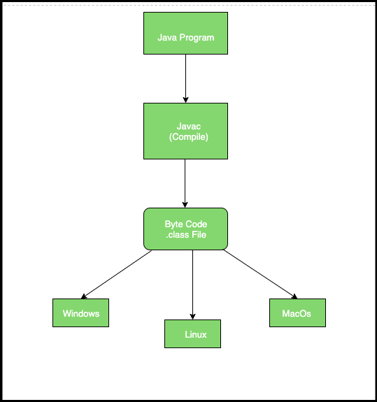

## JVM Architecture Report

### 1. JVM Components Overview

**JVM Architecture Diagram**


**High‑level data flow diagram:**

- **Class Loader Subsystem**
  - **Loading** → Reads `.class` files (bytecode) from disk/JARs/network.
  - **Linking**
    - **Verification** → Ensures bytecode is safe and follows JVM rules.
    - **Preparation** → Allocates memory for class variables and sets default values.
    - **Resolution** → Replaces symbolic references with direct references.
  - **Initialization** → Executes static initializers and assigns explicit values.

- **Runtime Data Areas**
  - **Method Area** → Stores class metadata, static variables, method bytecode.
  - **Heap** → Stores all objects and their instance fields (shared across threads).
  - **Java Stacks (per thread)** → Holds frames for each method call.
  - **PC Register (per thread)** → Holds address of the current instruction being executed.
  - **Native Method Stack (per thread)** → Used for native (JNI) method calls.

- **Execution Engine**
  - **Interpreter** → Reads bytecode instruction‑by‑instruction and executes it.
  - **JIT Compiler** → Compiles frequently executed (“hot”) bytecode into native machine code.
  - **Garbage Collector (GC)** → Automatically reclaims memory for unreachable objects in the heap.

### 2. JIT Compiler vs Interpreter

- **Interpreter**
  - Executes bytecode line‑by‑line (instruction by instruction).
  - **Pros**: Fast startup; good for code that runs only a few times.
  - **Cons**: Slower for long‑running, frequently executed code because each instruction is repeatedly decoded.

- **JIT (Just‑In‑Time) Compiler**
  - Monitors which methods/loops are executed often (hot spots).
  - Compiles those hot sections of bytecode into **native machine code** at runtime.
  - **Pros**: Much faster execution for hot code paths; performance can approach that of native C/C++.
  - **Cons**: Extra compilation overhead and memory use; benefits appear after some warm‑up time.

- **How they work together**
  - The JVM typically starts with the **interpreter** for quick startup.
  - As profiling data shows hot methods, the **JIT compiler** compiles them to native code.
  - Subsequent calls to those methods run the optimized native code instead of interpreted bytecode.

### 3. Bytecode Execution Process

1. **Compilation by `javac`**
   - Java source (`.java`) is compiled by `javac` into platform‑independent **bytecode** (`.class` files).

2. **Class Loading**
   - When a class is first used, the **Class Loader** loads its `.class` file into the JVM.
   - The class is **verified**, **prepared**, **resolved**, and **initialized** in the Runtime Data Areas.

3. **Method Invocation and Frame Creation**
   - Each method call creates a new **stack frame** on the thread’s Java stack.
   - The frame contains: local variables, operand stack, and references to the constant pool and the current class.

4. **Instruction Execution**
   - The **PC Register** points to the next bytecode instruction.
   - The **Execution Engine**:
     - Initially **interprets** the bytecode instructions.
     - For hot methods, the **JIT compiler** compiles them into native code.

5. **Native Interactions**
   - If a method calls native code (via JNI), the **Native Method Stack** and OS libraries are used.

6. **Garbage Collection**
   - As execution proceeds, unreachable objects on the **Heap** are detected and reclaimed by the **GC**, freeing memory automatically.

### 4. “Write Once, Run Anywhere” (WORA)

Write Once, Run Anywhere means that a Java program can be written on one system and run on any other system, without modification — as long as that system has a Java Virtual Machine (JVM).
In other words, Java code is platform-independent.



**How It Works — Step by Step**

1. **Write Java source code**

   ```java
   public class HelloWorld {
       public static void main(String[] args) {
           System.out.println("Hello, world!");
       }
   }
   ```

   Saved as `HelloWorld.java`.

2. **Compile the code with the Java compiler (`javac`)**

   ```bash
   javac HelloWorld.java
   ```

   This produces platform‑independent **bytecode**, stored in `HelloWorld.class`.

3. **Bytecode is platform‑independent**

   Java bytecode is a set of intermediate instructions understood by the **JVM**, not directly by the OS or CPU.
   That means the same `HelloWorld.class` file can run on **Windows**, **macOS**, **Linux**, or even **Android**, as long as a compatible JVM is installed.

4. **The JVM interprets or JIT‑compiles the bytecode**

   When you run:

   ```bash
   java HelloWorld
   ```

   The JVM on that platform takes the `.class` file and executes it:
   - It may **interpret** the bytecode instruction by instruction, or
   - Use the **JIT compiler** to turn hot sections into optimized native machine code for better performance.

