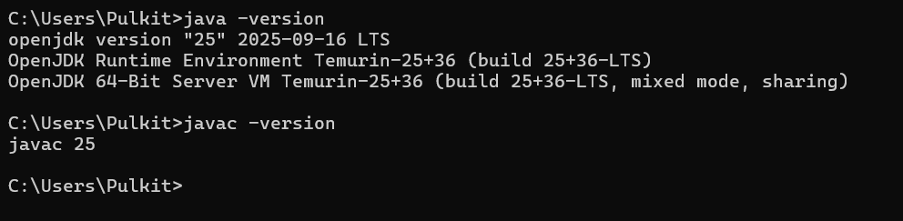
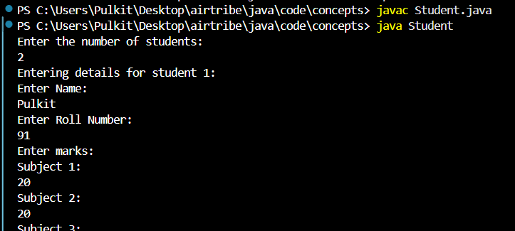

## Setup Documentation

### 1. Install JDK and Configure Environment

- **Download JDK**
  - Go to the official Oracle JDK or OpenJDK website.
  - Download and install **JDK 25** (or the version required by the project).

- **Set `JAVA_HOME`**
  - Find your JDK install path, e.g. `C:\Program Files\Java\jdk-25`.
  - Open **System Properties → Advanced → Environment Variables**.
  - Under **System variables**, click **New**:
    - **Variable name**: `JAVA_HOME`
    - **Variable value**: `C:\Program Files\Java\jdk-25`

- **Update `PATH`**
  - In **System variables**, select `Path` → **Edit** → **New**.
  - Add: `%JAVA_HOME%\bin`
  - Click **OK** on all dialogs to save.

- **Verify Installation**
  - Open a new **PowerShell** or **Command Prompt** window and run:

    ```bash
    java -version
    javac -version
    ```

  - Both commands should print the installed JDK version without errors.
  - Visual confirmation of JDK installation:

    

### 2. Screenshot of successful Java compilation and execution.


